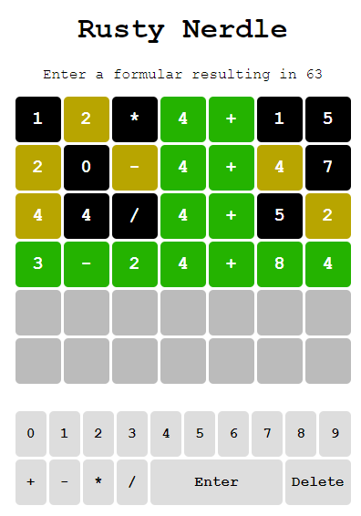

# Rusty *Nerdle* Game



## Introduction

In this hands-on lab, we are going to implement our own variant of a number guessing game similar to [*mathler*](https://www.mathler.com/) or [*nerdle*](https://nerdlegame.com/). The rules for our game are:

* The player gets an expected result (value >= 0 and <= 99) and has to guess an equation resulting in that value.
* The equation fulfills the following rules:
  * It consists of three numbers separated by two operators (e.g. *15/5+10*).
  * The total length of the equation's string representation is 7 characters.
  * Each number is >= 1 and <= 99.
  * Four operators: `+`, `-`, `*`, `/`
  * `*` and `/` have precedence over `+` and `-`.
  * Intermediate results are always integers, never floats (i.e. `5/3` will never be in a fomula while `6/3` can).
* The result fulfills the following rules:
  * It is >= 0 and <= 99.
  * It is an iteger number, not a float.

## Storyboard

To complete the hands-on lab, follow the following steps. After each step, make yourself familiar with the dependencies of the project. If you do this hands-on-lab in a Rust course, your trainer will probably work through the code with you.

### Create Rust Project

* Create a new library project with `cargo new nerdle --lib`.
* Copy content of [*Cargo.toml*](Cargo.toml) over the auto-created *Cargo.toml* file.

### First Steps

* Copy the region *External dependencies* from [*lib.rs*](src/lib.rs) into your *src/lib.rs* file.
* Copy the region *Initialization function* from [*lib.rs*](src/lib.rs) into your *src/lib.rs* file. It contains a first Rust function callable from JavaScript.
* Build the Wasm module with `wasm-pack build`.

### Operators

* Copy the region *Operators* from [*lib.rs*](src/lib.rs) into your *src/lib.rs* file. It implements the operators for our game.
* Add a test module at the end of your *src/lib.rs* file:

    ```rs
    #[cfg(test)]
    mod tests {
        extern crate wasm_bindgen_test;
    
        use super::*;
        use wasm_bindgen_test::*;
        use evalexpr::*;

        // <<< HERE we will add unit tests
    }
    ```

* Copy the region *Operator tests* from [*lib.rs*](src/lib.rs) into your *src/lib.rs* file's test module. It implements some unit tests for the operators of our game.
* Run the tests with `wasm-pack test --node`. They should succeed.

### Generating the Challenge

* Copy the region *Challenge data structure* from [*lib.rs*](src/lib.rs) into your *src/lib.rs* file. It contains the data structure used to communicate between Rust and JavaScript. Note that it is serializable.
* Copy the region *Generate challenge* from [*lib.rs*](src/lib.rs) into your *src/lib.rs* file. It implements the generation of the equation and the calculation of the expected result.
* Copy the region *Generation tests* from [*lib.rs*](src/lib.rs) into your *src/lib.rs* file's test module. It implements a unit tests for the challenge generation.
* Run the tests with `wasm-pack test --node`. They should succeed.
* Build the Rust library into an NPM package with `wasm-pack build`.

### Web Client

* Create a subfolder *www*.
* Copy the files from [*www*](www) into your *www* folder. Take a look at [*package.json*](www/package.json) and see how the Rust NPM package is referenced.
* Run `npm install`.
* Run `npm start` to start *webpack*'s development web server.
* Open [http://localhost:8080/](http://localhost:8080/) and have fun with your guessing game!
